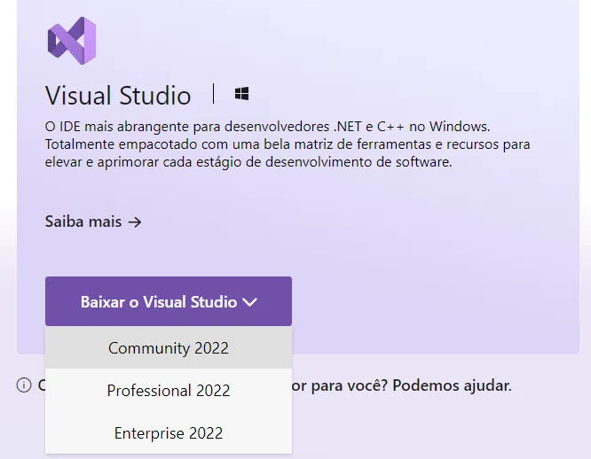
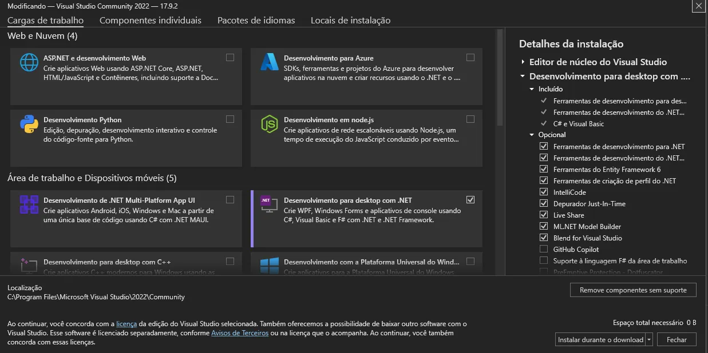
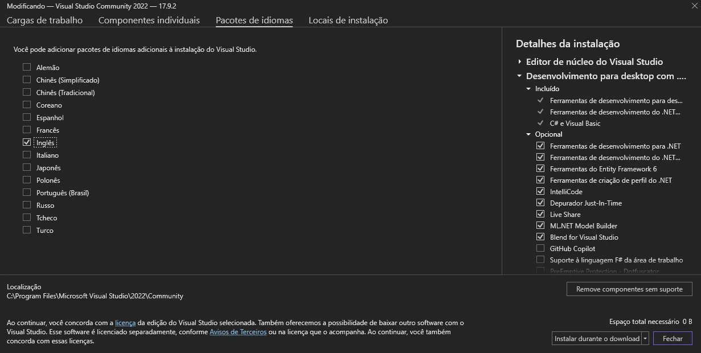
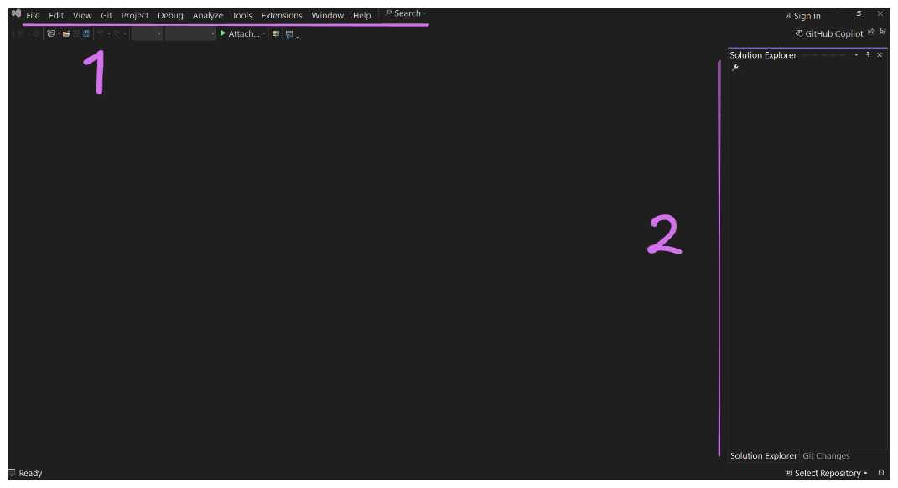
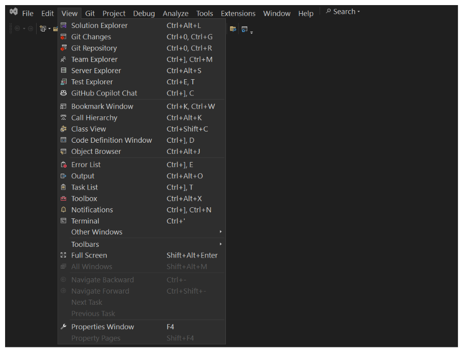

## Instalação da IDE Visual Studio

O Visual Studio é uma Integrated Development Environment (IDE, ou Ambiente de Desenvolvimento Integrado) desenvolvida pela Microsoft. É uma ferramenta poderosa usada para desenvolvimento de software em várias linguagens de programação, como C#, VB.NET, C++, Python, entre outras. 

O Visual Studio oferece um amplo conjunto de funcionalidades para ajudar os desenvolvedores em diversas etapas do desenvolvimento de software, desde a escrita do código até a sua depuração e teste.

### Download do Instalador

[https://visualstudio.microsoft.com/pt-br/](https://visualstudio.microsoft.com/pt-br/)

> A versão Community é **gratuita para estudantes** e para programadores trabalhando em projetos pessoais.

### Visual Studio Installer

O instalador do Visual Studio é utilizado tanto para instalação inicial do programa, como também pela configuração dos módulos do mesmo.

#### Opções de Instalação

Inicialmente, iremos utilizar o workload .NET desktop development.

#### Linguagem

Também iremos instalar o Visual Studio 2022 na versão Inglês.

## Visual Studio

Ao abrir o Visual Studio, seremos apresentados à tela inicial do programa, aqui podemos continuar o trabalho em projetos já abertos através de um histórico, criar novos projetos ou soluções ou clonar soluções do GitHub.

No momento, iremos clicar em `Continue without code` para apenas abrir a IDE, sem um projeto.

Esta é a interface do Visual Studio. Iremos utilizar esta ferramenta por um bom tempo trabalhando com C#, portanto devemos nos acostumar com ela.

**Elementos básicos da interface:**

1. **Barra de ferramentas:** Aqui estão localizadas todas as janelas, configurações e ações que podemos utilizar dentro da IDE.
2. **Solution Explorer:** Janela que exibe os projetos e arquivos relacionados à solução aberta. No momento, não temos uma solução criada.

Ao clicarmos em `View` na barra de ferramentas, podemos abrir janelas auxiliares, incluindo o próprio **Solution Explorer**, outras janelas importantes são: **Git Changes**, **Git Repository**, **Server Explorer** e **Terminal**.

