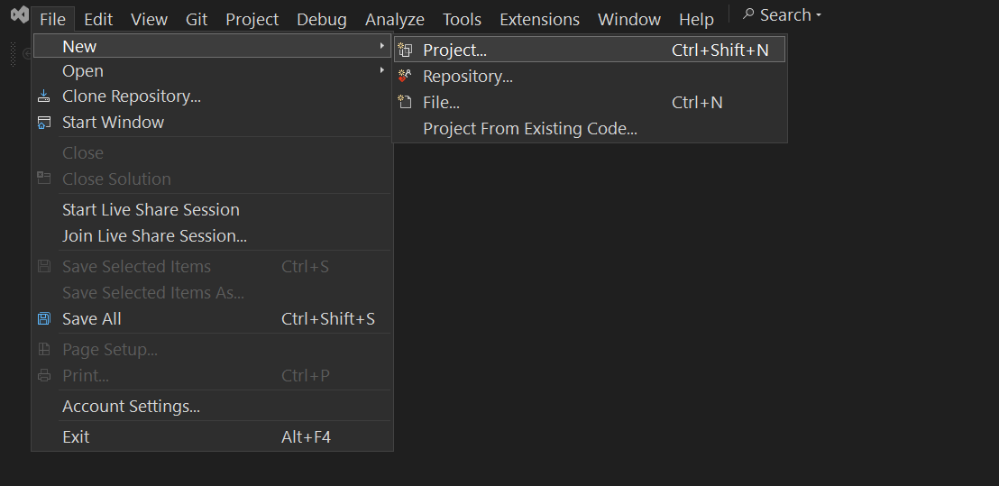
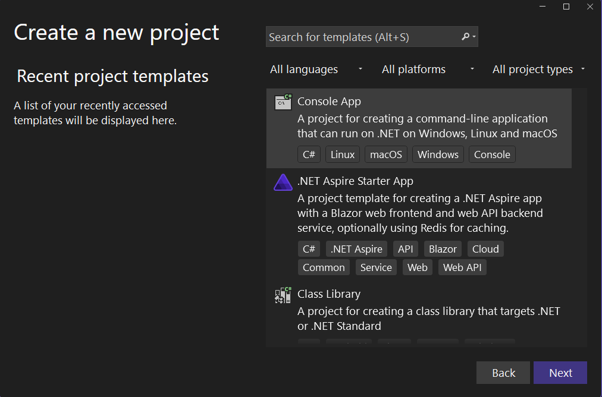
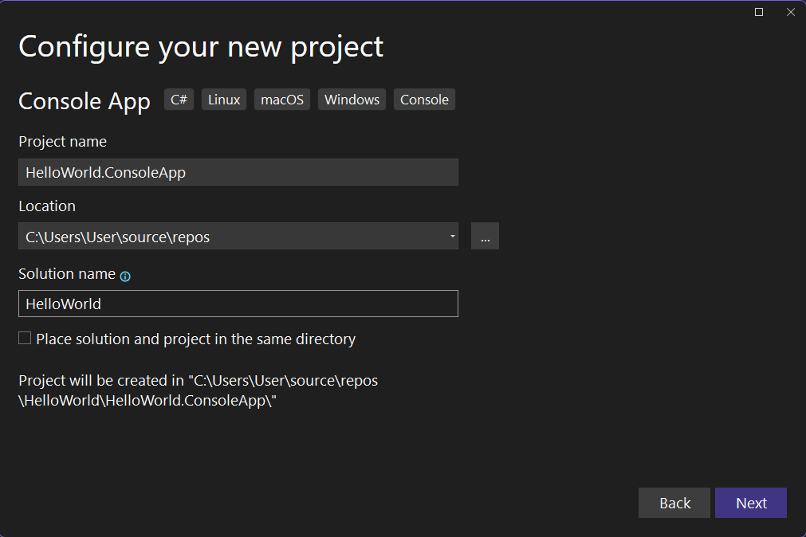
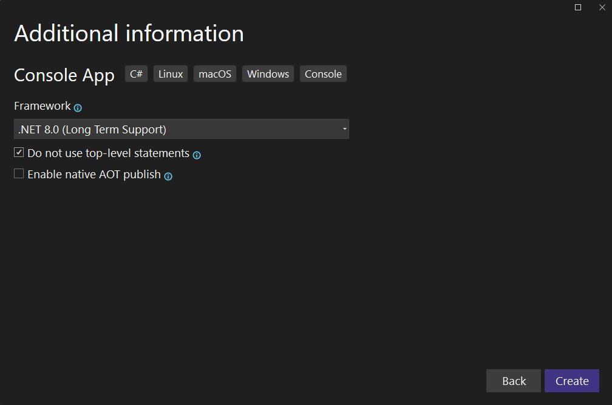
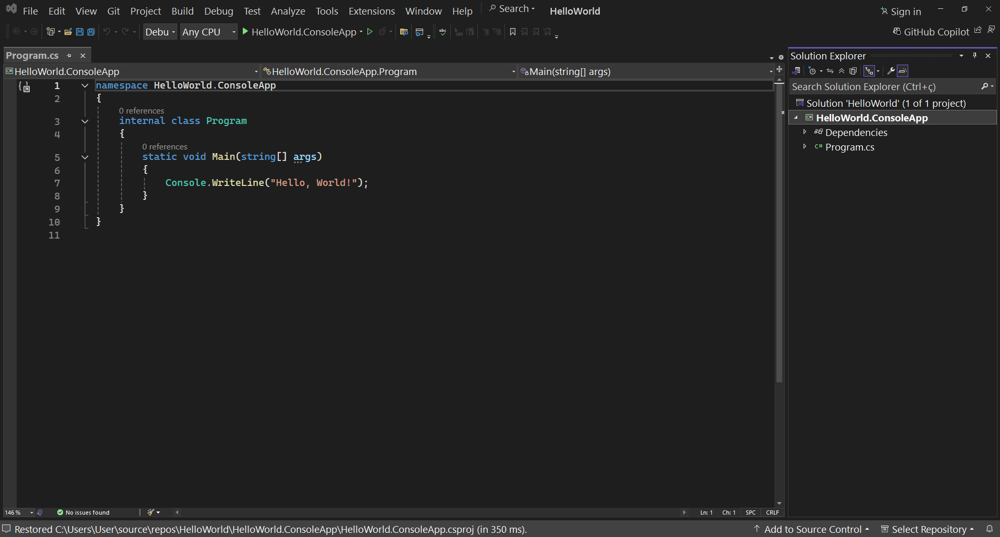

## Solução

Para iniciarmos uma nova solução e projeto, com o Visual Studio já aberto, iremos clicar em `New > Project`.

Uma **solução** é um contêiner que pode conter um ou mais projetos. Ela serve para organizar o desenvolvimento de uma aplicação grande, onde diferentes partes podem estar separadas em projetos individuais. Todo projeto C# está dentro de uma solução.

## Projeto

Para criar um projeto do tipo Aplicação de Console, iremos selecionar o template `Console App`.

Após isso, devemos definir as informações básicas do projeto, na primeira caixa de texto, selecionamos o nome do projeto em específico, que nomearemos como `HelloWorld.ConsoleApp`, note que colocamos o tipo do projeto como sufixo.

Abaixo desta opção, você pode escolher em qual localização do sistema o projeto será criado. Por último, temos a caixa de texto pedindo o nome da solução, informamos `HelloWorld`, o nome do programa que estamos criando (note que não incluimos sufixo no nome da solução).

A próxima tela nos dará configurações iniciais para nosso projeto, iremos selecionar o framework .NET 8 (LTS) e também checar a opção `Do not use top-level statements`. Após isso clicamos em Create.

## Projeto Hello World

Com isso, temos nossa primeira solução e projeto de aplicação de console criadas! À partir daqui, podemos criar novos projetos e arquivos, rodar nosso projeto, executar depuração, entre outros.

