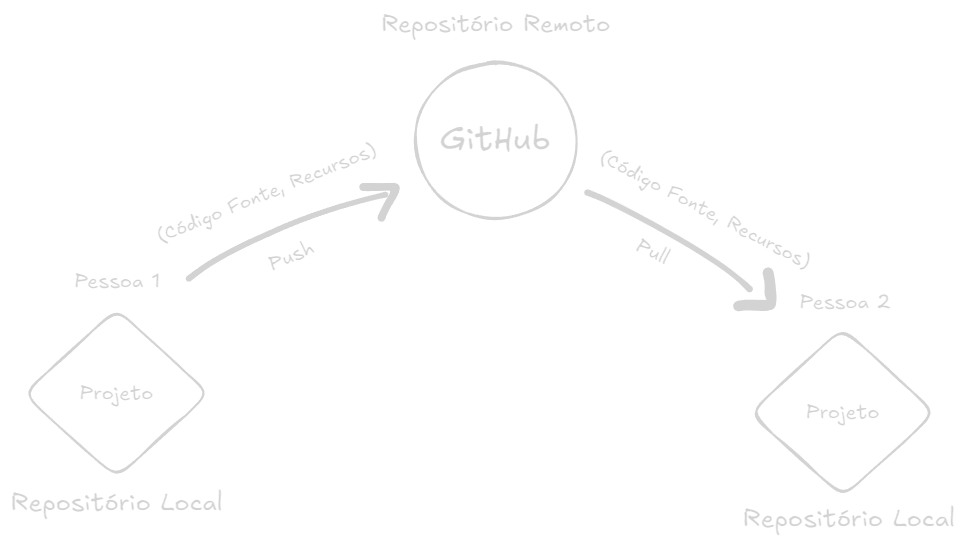
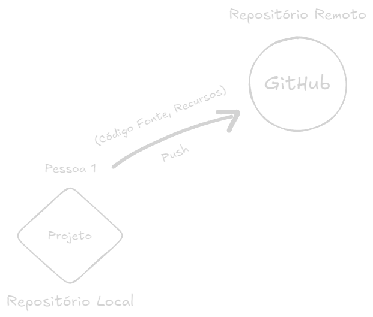
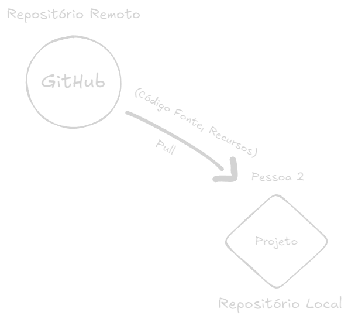

O **Git** é um sistema de controle de versão distribuído, usado para rastrear mudanças em arquivos e coordenar o trabalho entre desenvolvedores. Ele permite que várias pessoas trabalhem em um projeto simultaneamente, mantendo um histórico de todas as alterações feitas no código. 

Algumas das principais funcionalidades do Git incluem:

- **Versionamento**: Rastreia todas as modificações no código.
- **Branches**: Permite criar ramificações independentes para desenvolvimento paralelo.
- **Merge**: Junta alterações feitas em diferentes branches.
- **Repositórios locais e remotos**: O código pode ser armazenado localmente e sincronizado com servidores remotos.

### Criar um repositório Git localmente

Se você já tem uma pasta com seu projeto, navegue até ela no terminal:

```sh
cd /caminho/do/seu/projeto
```

Agora, inicialize o Git dentro dessa pasta com:

```sh
git init
```

Isso cria uma pasta oculta chamada `.git`, onde o Git armazenará o histórico do seu projeto.

### Commits

No Git, um **commit** é um registro de alterações feitas no código. Cada commit funciona como um "salvamento" do projeto em um determinado estado, permitindo que você acompanhe o histórico de modificações e, se necessário, volte para versões anteriores.

**Quando você faz um commit, o Git:** 

- Salva as mudanças registradas no **staging area** (área de preparação).  
- Atribui um identificador único (hash) ao commit.  
- Mantém um histórico completo das alterações feitas no projeto.

#### Exemplo de um fluxo básico de commit:

Verificar quais arquivos foram modificados:

```sh
git status
```

Adicionar arquivos ao rastreamento do git (staging):

```sh
git add nome-do-arquivo
```

Ou para adicionar **todos os arquivos modificados**:

```sh
git add .
```

Criar um commit com uma mensagem descritiva:

```sh
git commit -m "Adicionando a funcionalidade de login"
```

#### Por que os commits são importantes?

- ✅ **Histórico do projeto**: Você pode ver todas as mudanças feitas ao longo do tempo.  
- ✅ **Rastreabilidade**: É possível saber **quem fez o quê e quando**.  
- ✅ **Rollback fácil**: Se algo quebrar, você pode reverter para um commit anterior.  
- ✅ **Colaboração eficiente**: Várias pessoas podem trabalhar no mesmo projeto sem conflitos.

### Push e Pull

O Git usa repositórios **locais** e **remotos** para sincronizar mudanças entre desenvolvedores. As operações `pull` e `push` são usadas para atualizar e enviar alterações entre esses repositórios.

#### Push



O comando `git push` envia seus commits locais para o repositório remoto, tornando suas alterações disponíveis para os outros membros da equipe.

**Comando de terminal:**

```sh
git push origin main
```

#### Pull



O comando `git pull` atualiza o repositório local com as últimas mudanças do repositório remoto. Ele faz duas coisas:

1. **Busca** (`fetch`) as alterações do repositório remoto.
2. **Mescla** (`merge`) essas alterações no seu branch atual.

**Comando do terminal:**

```sh
git pull origin main
```

### GitHub

O **GitHub** é uma plataforma de hospedagem de repositórios Git baseada na nuvem. Ele facilita a colaboração entre desenvolvedores, permitindo que os repositórios sejam acessados de qualquer lugar. Algumas das principais funcionalidades do GitHub incluem:

- **Hospedagem de código**: Armazena repositórios Git na nuvem.
- **Controle de permissões**: Define quem pode acessar e modificar os repositórios.
- **Pull Requests**: Permite revisões de código antes da fusão de branches.
- **Ações do GitHub (GitHub Actions)**: Automatiza testes, deploys e outras tarefas.

**Qual a diferença entre Git e GitHub?**

- **Git** é a ferramenta de controle de versão.
- **GitHub** é um serviço baseado na nuvem para hospedar e gerenciar projetos Git.